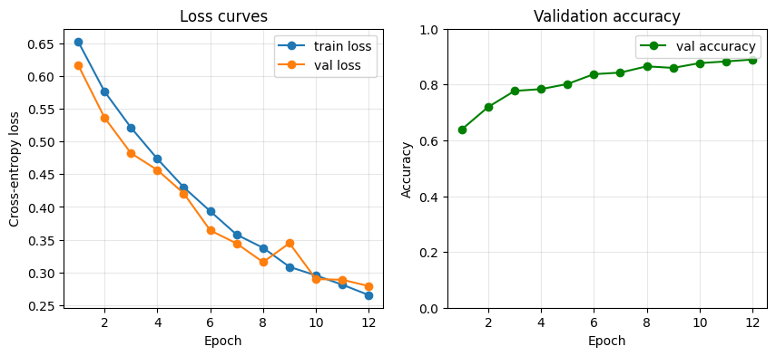
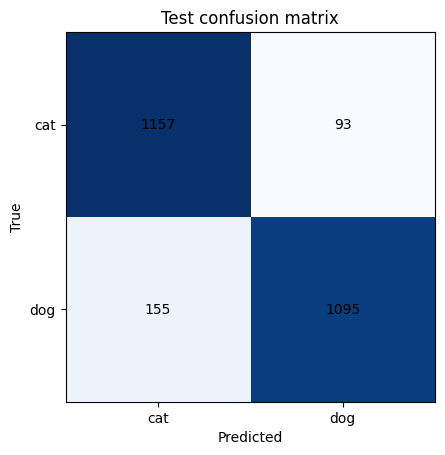

**MLOps S1-25_AIMLCZG523 — Assignment 2**

**Student:** Adithya M Sasi (2024AC05785)

**Repository:** https://github.com/axle-bits/MLOPS_Assignment_2

**Docker image:** https://hub.docker.com/r/axlebits/catsdogs-api

**Video (YouTube):** [ADD LINK BEFORE SUBMISSION]

**Video (Google Drive):** [ADD LINK BEFORE SUBMISSION]

**Model artifacts (Drive):** [ADD LINK BEFORE SUBMISSION]

---

# Cats vs Dogs — MLOps Pipeline

Binary image classification (cats vs dogs) for a pet adoption platform, built as an
end-to-end MLOps pipeline: data versioning (DVC), experiment tracking (MLflow), a
FastAPI inference service, Docker containerization, GitHub Actions CI/CD, and
Prometheus-style monitoring.

The baseline CNN (`src/inference/model.py`) is selected from a three-configuration
MLflow sweep and reaches **90.1% accuracy on the held-out test split**; the deployed
service scored **96% on a 100-image sample** sent through its `/predict` endpoint. See
[Experiment results](#experiment-results) for the per-run breakdown.

## Requirement coverage

| Module | Marks | Where it's satisfied |
| --- | --- | --- |
| M1 — Model Development & Experiment Tracking | 10 | Git + DVC for versioning; `src/train/train.py`; MLflow runs in `mlruns/` — see [Experiment results](#experiment-results) |
| M2 — Model Packaging & Containerization | 10 | `src/api/main.py` (FastAPI); `Dockerfile`; `requirements.txt` — see [Run the API locally](#run-the-api-locally) |
| M3 — CI Pipeline | 10 | `tests/` (19 pytest tests); `.github/workflows/ci.yml` — see [Testing](#testing) and [CI/CD](#cicd) |
| M4 — CD Pipeline & Deployment | 10 | `deploy/docker-compose.yml`; `.github/workflows/cd.yml`; `scripts/smoke_test.py` — see [CI/CD](#cicd) |
| M5 — Monitoring, Logs & Final Submission | 10 | `/metrics`; `scripts/evaluate_deployed.py` — see [Monitoring](#monitoring) and [Post-deployment evaluation](#post-deployment-evaluation) |

The dataset-prep requirements stated above the modules in the brief (224x224 RGB,
80/10/10 split, data augmentation) are covered by `src/data/preprocess.py` and the
training-time augmentation described in [Train the model](#train-the-model).

## Project layout

- `src/data/preprocess.py` — preprocessing (resize to 224x224 RGB, per-class 80/10/10
  split); wired up as the `preprocess` stage in `dvc.yaml`
- `src/train/train.py` — training loop with MLflow logging (params, per-epoch metrics,
  held-out test metrics, confusion matrix + loss curve artifacts, model checkpoint)
- `src/inference/` — model definition (`model.py`, a small CNN) and predict logic
  (`predict.py`), shared by the API and the scripts
- `src/api/main.py` — FastAPI service (`/health`, `/predict`, `/metrics`)
- `tests/` — pytest unit tests (preprocessing, model, inference, API, metrics,
  evaluate_deployed)
- `scripts/smoke_test.py` — post-deploy health check + single-image prediction check
- `scripts/evaluate_deployed.py` — samples the test split against the live API and
  writes an accuracy/precision/recall report
- `deploy/docker-compose.yml` — deployment manifest
- `Dockerfile` — inference service image (CPU-only torch build, trained weights included)
- `.github/workflows/ci.yml` — CI: test, build, and publish to Docker Hub
- `.github/workflows/cd.yml` — CD: deploy + smoke test on the self-hosted runner
- `dvc.yaml` / `dvc.lock` — DVC pipeline definition (`data/raw/PetImages` ->
  `data/processed`)
- `data/raw/PetImages.dvc` — DVC pointer file; the raw images live in the DVC remote,
  not in git
- `.dvc/config` — DVC remote configuration
- `models/model.pt` — trained weights, committed to git (13 MB) and copied into the
  Docker image so the published image is self-contained
- `mlruns/` — local MLflow tracking store, gitignored
- `results/` — output of `scripts/evaluate_deployed.py`, committed as evidence
- `docs/` — loss curves and confusion matrices for the selected run, copied out of
  MLflow so they can be read without starting the tracking UI
- `postman/` — Postman collection for manually verifying the deployed endpoints

### What DVC tracks, and what it doesn't

DVC versions the **dataset**: the raw Kaggle images (`data/raw/PetImages.dvc`) and the
preprocessed 224x224 splits (the `preprocess` stage output in `dvc.yaml`/`dvc.lock`),
which together are ~1.2 GB and cannot live in git.

The trained model is **not** DVC-tracked. At 13 MB it fits comfortably in git, and
committing it is what lets CI embed the real weights into the Docker image — so the
published image runs correctly on any machine with no bind mount, no DVC remote access,
and no model download. Model artifacts are additionally versioned per-run by MLflow,
which stores a checkpoint alongside the params and metrics that produced it.

## One-time setup

Local development uses a project-local virtual environment rather than the global
Python install.

```powershell
python -m venv .venv
.venv\Scripts\python.exe -m pip install -r requirements-dev.txt
.venv\Scripts\dvc pull
```

There are three dependency files, layered:

- `requirements.txt` — runtime only (torch, FastAPI, Pillow, prometheus-client, …).
  This is what the Docker image installs, so the serving image carries no test or
  training tooling.
- `requirements-test.txt` — runtime + pytest/httpx. This is what CI installs.
- `requirements-dev.txt` — the above plus MLflow, DVC, scikit-learn and matplotlib, for
  training and experiment tracking locally.

The DVC remote (`.dvc/config`) is a **local folder** at `../dvc-storage/assignment2`
(a directory sibling to this repo, not inside it) — `dvc pull` / `dvc push` are plain
file copies with no credentials, OAuth, or Google Drive setup required.

### GPU training (optional)

`requirements.txt` installs the CPU build of torch. To train on a local GPU, reinstall
the matching CUDA build after the setup above (adjust the version tag to your CUDA
toolkit and to whatever torch/torchvision versions are currently pinned in
`requirements.txt`):

```powershell
.venv\Scripts\python.exe -m pip install torch==2.12.0 torchvision==0.27.0 --index-url https://download.pytorch.org/whl/cu130 --force-reinstall --no-deps
```

## Train the model

```powershell
# 1. Preprocess raw images into the 224x224 train/val/test split (skip if
#    data/processed was already restored by `dvc pull`, or re-run to regenerate it)
.venv\Scripts\dvc repro preprocess

# 2. Train (auto-picks cuda if available)
.venv\Scripts\python.exe -m src.train.train --epochs 15 --lr 5e-4 --run-name my-run

# 3. Commit the new weights
git add models/model.pt && git commit -m "Retrain model"
```

Data augmentation is applied at training time rather than written into the preprocessed
files: random horizontal flip, random rotation up to 15 degrees, and colour jitter on
brightness and contrast. Validation and test images use a resize-only transform, so
evaluation is never done on augmented data.

Each run logs to MLflow under the `catsdogs-baseline-cnn` experiment (local store at
`./mlruns`): parameters, per-epoch `train_loss`/`val_loss`/`val_accuracy`, final
`test_loss`/`test_accuracy` on the held-out test split, and three artifacts —
`loss_curves.png`, `confusion_matrix_val.png` and `confusion_matrix_test.png` — plus the
model checkpoint. Compare runs with:

```powershell
.venv\Scripts\mlflow ui
```

then open `http://localhost:5000`.

The test split is only ever touched by this final evaluation and by
`scripts/evaluate_deployed.py`; it is never used for training or model selection.

## Run the API locally

Directly, using the venv:

```powershell
.venv\Scripts\python.exe -m uvicorn src.api.main:app --host 0.0.0.0 --port 8000
```

Or built into a container, same as the CI/CD image. No volume mount is needed — the
weights are inside the image:

```bash
docker build -t catsdogs-api:local .
docker run -d -p 8000:8000 catsdogs-api:local
```

Verify both endpoints against the running container:

```bash
curl http://localhost:8000/health
# {"status":"ok","model_loaded":true}

curl -F "file=@scripts/sample_pet.jpg" http://localhost:8000/predict
# {"label":"cat","probabilities":{"cat":0.9914933443069458,"dog":0.008506596088409424},"model_version":"1.0.0"}
```

On Windows PowerShell, `curl` is an alias for `Invoke-WebRequest`, which does not accept
`-F` and will fail. Use `curl.exe` explicitly there, or run the commands from Git Bash.

### Postman

`postman/catsdogs-api.postman_collection.json` covers the same checks as a collection:
health, a prediction, the 400 on a non-image upload, and the metrics endpoint. Import it
into Postman, then open the **Predict** request and select an image for the `file` form-data
key (`scripts/sample_pet.jpg` works) — Postman cannot store the file path portably, so
that selection is a one-time step per machine. Each request carries assertions, so
**Send** reports pass/fail rather than leaving you to eyeball the response.

The API reads its weights from `MODEL_PATH` (default `models/model.pt`, which is where
the Dockerfile puts them) and exposes:

- `GET /health` — liveness check, reports whether the model loaded
- `POST /predict` — multipart image upload, returns `{"label": "cat"|"dog", "probabilities": {...},
  "model_version": "..."}`
- `GET /metrics` — Prometheus text-format metrics (request counts and latency histograms)

Model loading is deliberately fail-fast: a missing or unreadable checkpoint raises at
startup rather than letting the service come up and silently serve random weights.

## Testing

```powershell
.venv\Scripts\python.exe -m pytest -v
```

19 tests across `tests/test_preprocessing.py`, `test_model.py`, `test_inference.py`,
`test_api.py`, `test_metrics.py` and `test_evaluate_deployed.py` — covering the
preprocessing split/validity logic, the model definition, inference helpers, all three
API endpoints, and the Prometheus metric calculations. This is the same command CI runs
on every push.

## Deploy via Docker Compose

```powershell
$env:DOCKERHUB_USERNAME = "axlebits"
docker compose -f deploy/docker-compose.yml pull
docker compose -f deploy/docker-compose.yml up -d
python scripts/smoke_test.py scripts/sample_pet.jpg
```

`deploy/docker-compose.yml` runs `${DOCKERHUB_USERNAME}/catsdogs-api:${IMAGE_TAG}`,
defaulting to `axlebits/catsdogs-api:latest` for manual deploys. CD overrides
`IMAGE_TAG` with the commit SHA (see below).

## CI/CD

**CI** (`.github/workflows/ci.yml`) runs on every push to any branch and on pull
requests into `main`: sets up Python 3.11, installs the CPU build of torch plus
`requirements-test.txt`, and runs `pytest -v`. On a push to `main` it additionally
builds and pushes the Docker image to Docker Hub as `axlebits/catsdogs-api:latest`
**and** `axlebits/catsdogs-api:<git-sha>` (using the `DOCKERHUB_USERNAME` /
`DOCKERHUB_TOKEN` repo secrets). On any other branch or PR it only does a
build-verification pass — image built, not pushed.

**CD** (`.github/workflows/cd.yml`) is triggered by a `workflow_run` event once the CI
workflow completes successfully on `main`. It checks out the exact commit CI tested and
deploys `IMAGE_TAG=<that commit's SHA>`, so the running container is provably the image
CI just built rather than whatever `:latest` currently resolves to. It then runs
`scripts/smoke_test.py` against the freshly deployed container; a failed smoke test
fails the workflow.

CD runs on `self-hosted`, **not** a GitHub-hosted runner — the job deploys via Docker
Compose directly onto the host machine, and a GitHub-hosted runner's VM is torn down
after the job, so it could not host a persistent deployment. For CD to pick up jobs, a
self-hosted runner must be registered and running on the deployment machine:

1. In the GitHub repo, go to **Settings > Actions > Runners > New self-hosted
   runner** and follow the generated download/config commands.
2. Start it with `run.cmd` (Windows) — it needs to stay running (or be installed as a
   service) for the CD workflow to have a runner to dispatch to.

The smoke test asserts more than a 200 response: it checks that a known cat image is
classified as `cat` with >0.6 confidence, so a deployment serving the wrong or an
untrained checkpoint fails the pipeline instead of passing a shape-only check.

## Monitoring

`src/api/main.py` installs an HTTP middleware that, for every request, emits a JSON log
line (endpoint, method, status, latency in ms) and updates two Prometheus metrics:

- `request_count{endpoint,status}` — a counter
- `request_latency_seconds{endpoint}` — a histogram

Both are exposed in Prometheus text format at `GET /metrics`, so the service can be
scraped by a Prometheus server without any code change. Predictions are logged as
label + probabilities; no image bytes or client identifiers are written to the logs.

## Post-deployment evaluation

```powershell
.venv\Scripts\python.exe scripts\evaluate_deployed.py --per-class 50
```

Sends `--per-class` images per class (default 50, i.e. 100 total) from
`data/processed/test` to the **running deployed API's** `/predict` endpoint, then writes:

- `results/evaluation.csv` — one row per image (path, true label, predicted label, both
  class probabilities)
- `results/evaluation_summary.json` — accuracy, per-class precision/recall/F1/support,
  and a confusion matrix

Both files are committed, so the measured post-deployment performance is part of the
submission rather than something a reader has to reproduce.

## Experiment results

Three configurations were trained and compared in MLflow:

| Run | lr | batch | epochs | val accuracy | test accuracy | test loss |
| --- | --- | --- | --- | --- | --- | --- |
| `baseline-lr1e-3-bs32-e8` | 1e-3 | 32 | 8 | 0.8372 | 0.8496 | 0.3482 |
| `lowlr-lr5e-4-bs32-e15` | 5e-4 | 32 | 15 | 0.8816 | 0.8940 | 0.2534 |
| **`bigbatch-lr1e-3-bs64-e12`** | 1e-3 | 64 | 12 | **0.8896** | **0.9008** | **0.2418** |

Model selection uses **validation** accuracy; the test split is reported but never used
to choose between runs. The winning configuration (larger batch, 12 epochs) is the
checkpoint committed at `models/model.pt` and embedded in the published image. The
earlier 8-epoch runs were still improving when they stopped, which is what the longer
schedules recover.

### Training artifacts

MLflow logs these per run; the copies below are from the selected run
(`bigbatch-lr1e-3-bs64-e12`) and also live in `docs/`.



Training and validation loss fall together for all 12 epochs with no widening gap, and
validation accuracy is still climbing at the last epoch — the model is underfitting
rather than overfitting, so a longer schedule or more capacity is where further accuracy
would come from.



On the 2,500-image test split: 1157/1250 cats and 1095/1250 dogs correct, i.e. the
0.9008 in the table above. Errors are close to symmetric, with a slight bias toward
predicting `cat` (155 dogs called cat vs 93 cats called dog). The validation confusion
matrix is at `docs/confusion_matrix_val.png`.

### Deployed service performance

Running `scripts/evaluate_deployed.py --per-class 50` against the deployed container
(100 images sent through HTTP `/predict`):

| Metric | Value |
| --- | --- |
| Accuracy | 0.96 |
| Cat precision / recall / F1 | 0.979 / 0.940 / 0.959 |
| Dog precision / recall / F1 | 0.942 / 0.980 / 0.961 |

Confusion matrix (rows = true, columns = predicted): 47/3 for cats, 1/49 for dogs.

Note that 0.96 here is measured on a 100-image subsample (the first 50 files per class
by filename), not the full 2,500-image test split — the full-test-set figure is the
0.9008 in the table above. The subsample is deterministic so the number is reproducible,
but it is a small sample and should be read as consistent with ~90%, not as a better
result.

Full per-image output is in `results/evaluation.csv`, and the metrics above are in
`results/evaluation_summary.json`.
